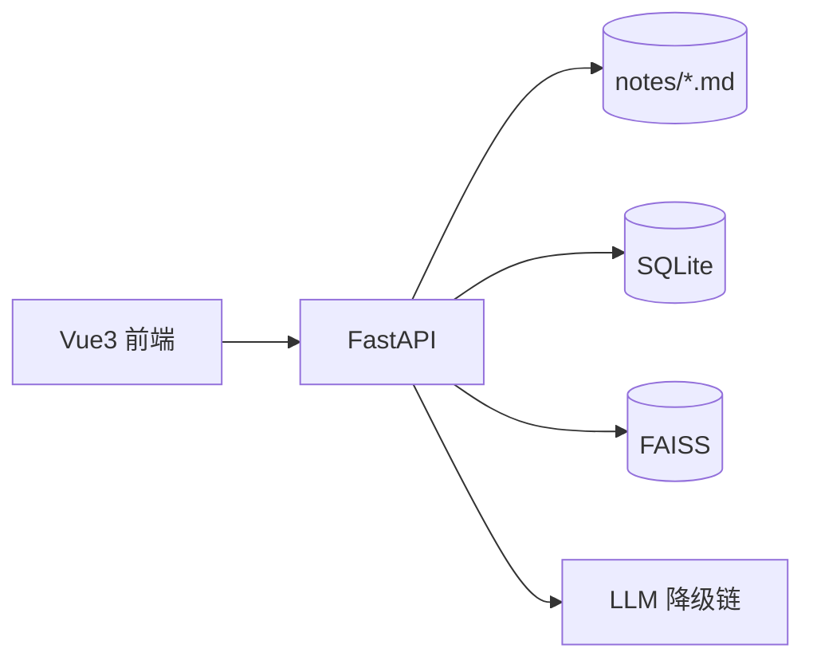

# WSnote

本地优先的 Markdown 个人知识库：笔记即文件，混合检索 + RAG 问答，内置检索质量评测。

## 功能特性

WSnote 是一个「clone 即跑」的本地知识库，核心能力：

- **笔记即 Markdown 文件**：内容以磁盘 `notes/*.md` 文件为唯一事实来源（git 友好、可备份、可 diff），SQLite 与向量库只是「搜索索引」。
- **混合检索**：BM25 稀疏检索 + 稠密向量检索，RRF 融合，可选 rerank 重排，返回带来源（笔记 + 小节）的命中块。
- **RAG 问答**：命中块 + LLM 生成回答，回答携带引用（笔记路径 + 小节标题）；无 LLM key 时自动降级为「仅检索」。
- **内置评测 harness**：golden 查询集 + recall@k / MRR / nDCG 指标 + 配置对比报告，检索质量可量化、可回归。
- **降级可靠**：无 LLM key、无 embedding 模型、无 FAISS 时均可用（自动降级，HTTP 200 而非 500）。

前端三视图：

- **笔记（`/`）**：左侧笔记列表（标题搜索 + 标签），右侧 vditor Markdown 编辑器，保存即触发增量索引。
- **搜索（`/search`）**：输入检索词，返回命中块，展示来源笔记、小节与相似度得分。
- **问答（`/chat`）**：聊天式提问，回答下方折叠展示引用（可定位到笔记对应小节）；未配置 LLM 时显示降级提示。

## 架构



- `notes/*.md`：磁盘 Markdown，唯一事实来源
- `SQLite`：分块 / FAISS 映射 / 评测记录
- `FAISS`：向量索引（磁盘落盘，`data/index.faiss`）
- `LLM 降级链`：无 key / 超时 → 降级为「仅检索」

数据流：前端保存笔记 → 落盘 `.md` → 增量索引（重新分块 + embedding，更新 SQLite 与 FAISS）；搜索 / 问答 → 混合检索 top-k（BM25 与向量 RRF 融合）→ 可选 rerank → 返回带来源的块；问答用命中块 + LLM 生成回答并携带引用。

## 快速开始

### 后端

```bash
# 1. 安装依赖（二选一）
pip install -e .                 # 可编辑安装（含全部依赖）
# pip install -r requirements.txt  # 无 uv 用户的纯 pip 列表

# 2. 索引笔记（分块 + embedding + 建向量索引）
python scripts/ws ingest

# 3. 启动 API
uvicorn app.main:app --port 8000
```

访问 <http://127.0.0.1:8000/api/notes> 应返回 `{"code":0,"data":[...]}`。

> **LLM key 可选**：未配置时问答自动降级为「仅检索」（返回命中块 + 引用，`degraded:true`），不阻塞其余功能。
> **embedding 模型可选**：离线 / 缺模型时自动降级为 FakeEmbedder（确定性假向量），检索仍可用。
> 配置项在 `app/core/config.py` 的 `Config` 默认值中修改（`llm_api_key` / `llm_base_url` / `llm_model` 等）。

### 前端

```bash
cd frontend
npm install
npm run dev
```

访问 <http://127.0.0.1:5173/>（Vite 已配置 `/api` 代理到 `http://127.0.0.1:8000`）。生产构建：`npm run build`，产物在 `frontend/dist/`。

### CLI

```bash
python scripts/ws ingest --rebuild      # 全量重建索引
python scripts/ws status                # 索引状态（JSON）
python scripts/ws search "关键词" -k 5   # 混合检索
python scripts/ws eval --golden eval/golden.json --configs '[{"chunk_size":512}]'
```

## 评测报告

评测集 `eval/golden.json`（24 条中文查询，标注相关块），运行 `python scripts/ws eval` 输出 Markdown 对比报告。本仓库当前实测：

```
# WSnote 检索质量评测报告

| 配置 | recall@5 | recall@10 | mrr@5 | mrr@10 | ndcg@5 | ndcg@10 |
|---|---|---|---|---|---|---|
| chunk_size=512 | 0.9375 | 1.0 | 0.5028 | 0.5097 | 0.599 | 0.6229 |
```

> 该报告在「无 sentence-transformers、embedding 降级 FakeEmbedder」的确定性环境下运行，BM25 稀疏检索命中查询词。

## 目录速览

```
WSnote/
├── pyproject.toml          # 依赖与 pytest 配置
├── requirements.txt        # 无 uv 用户的纯 pip 依赖
├── README.md
├── LICENSE
├── eval/golden.json        # 检索评测集（24 条查询）
├── notes/                  # 示例笔记（也是 demo 内容）
├── scripts/ws              # CLI 入口（ingest / search / status / eval）
├── app/
│   ├── main.py             # FastAPI 入口
│   ├── api/                # notes / search / chat / tags / index
│   ├── core/               # config / db / embeddings / llm 抽象
│   ├── notes/              # 笔记 CRUD（frontmatter）
│   ├── ingest/             # 分块 + embedding + 向量库
│   ├── retrieval/          # BM25 + 混合检索 + rerank
│   ├── chat/               # RAG 问答（引用 + 降级）
│   └── eval/               # 指标 + 评测 runner
├── frontend/               # Vue3 + Vite + Element Plus + vditor
└── tests/                  # pytest（39 个用例）
```

> `data/`（SQLite + FAISS 索引）已 git-ignore：索引可随时从 `notes/` 重建，`notes/` 示例笔记随仓库提交。

## 测试

```bash
pip install -e ".[dev]"   # 或 pip install pytest pytest-asyncio httpx
pytest -q
```

当前 39 个测试全部通过。

## License

[MIT](./LICENSE) · Copyright (c) 2026 wshsds00
